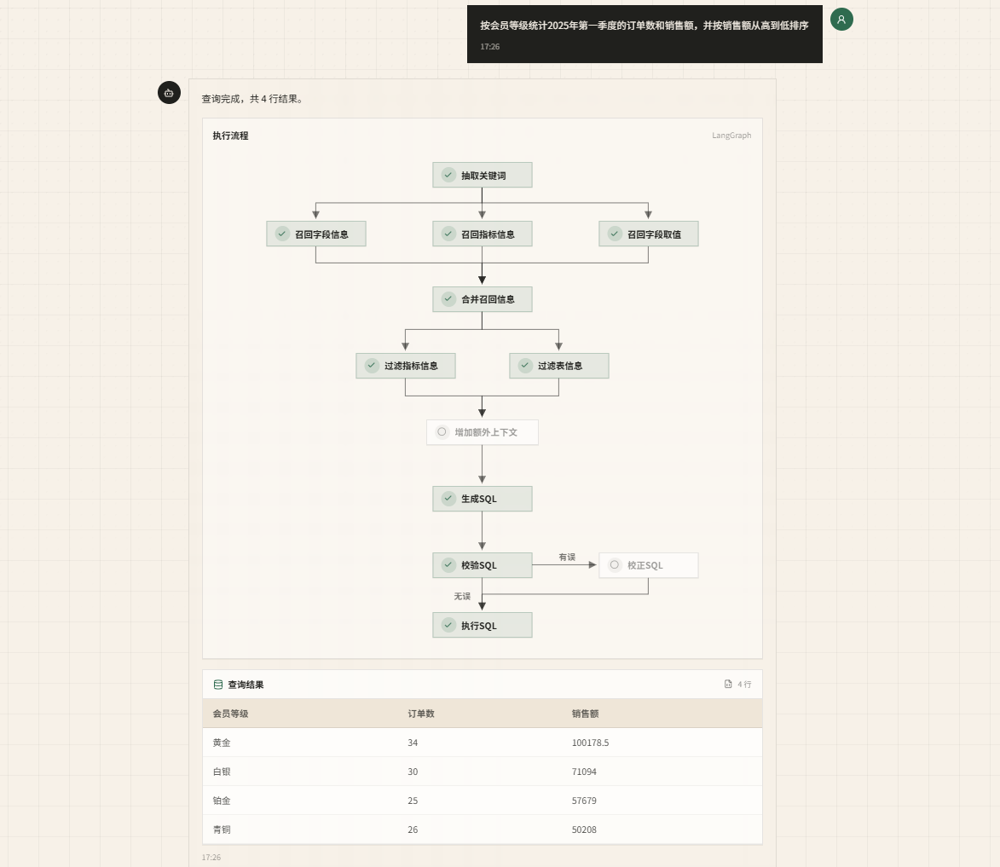

<div align='center'>
  <h1 style="margin-top: 15px;">「电商问数」智能数据分析 Agent</h1>
  <h4><b>shopkeeper-agent</b></h4>
  <p><em>基于 LangGraph 构建的智能问数系统，覆盖混合检索、多阶段推理、SQL 生成与执行的完整链路</em></p>
</div>

<div align='center'>


</div>

## 📖 项目介绍

在实际业务场景中，业务人员通常不具备 SQL 编写能力，数据分析人员也难以时刻掌握所有表结构、字段含义、指标口径及取值范围。若直接将自然语言问题交给大模型处理，容易出现表选择错误、字段映射偏差、指标理解偏差及 SQL 幻觉等问题。

`电商问数` 旨在解决上述问题：

- 用户通过自然语言发起查询
- 系统自动召回相关字段、指标及字段取值
- 大模型基于上下文进行分步推理
- 生成 SQL 并执行数据仓库查询
- 以流式方式返回分析结果

## ✨ 项目亮点

- **检索 + 推理 + 生成的三段式架构**
    - 先基于问题召回相关字段、指标和值域，再构建上下文生成 SQL，整体流程更加稳定可控。
- **面向企业场景的混合检索方案**
    - `Qdrant` 承担字段和指标的语义召回
    - `Elasticsearch` 承担字段取值的全文检索
    - `MySQL` 存储结构化的元数据信息
- **字段、指标、取值三类信息协同召回**
    - 相较于表级或字段级检索，更贴合实际企业分析需求。
- **端到端的完整可运行链路**
    - 超越 Prompt 设计层面，真正实现 SQL 生成、查询执行及流式结果返回。
- **清晰的工程化后端架构**
    - 采用 `FastAPI + LangGraph + Repository + Client Manager` 分层设计，涵盖配置、客户端、仓储层、服务层与智能体流程。
- **良好的可扩展性**
    - 可在此基础上扩展权限控制、SQL 审核、结果可视化等功能。

## 🏗️ 系统架构


项目围绕两条主线构建：

| 主线             | 功能描述                                                                 | 技术组件                                     |
| ---------------- | ------------------------------------------------------------------------ | -------------------------------------------- |
| 元数据知识库构建 | 从数仓抽取表、字段、指标及取值，写入结构化库、向量库和全文索引           | `MySQL` / `Qdrant` / `Elasticsearch` / `TEI` |
| 自然语言问数     | 基于用户问题执行召回、上下文整理、SQL 生成校验执行，并将过程流式返回前端 | `LangGraph` / `FastAPI` / `SSE` / `React`    |



## 🛠️ 项目技术栈

| 模块       | 技术栈                             | 说明                                             |
| ---------- | ---------------------------------- | ------------------------------------------------ |
| 数据仓库   | `MySQL`                            | 承载事实表、维度表及分析型查询                   |
| 元数据库   | `MySQL` / `SQLAlchemy`             | 存储表、字段、指标及字段指标关系等元数据         |
| 向量检索   | `Qdrant`                           | 存储字段和指标向量，支持语义检索                 |
| 全文检索   | `Elasticsearch`                    | 存储字段实际取值，支持关键词及值域检索           |
| Embedding  | `TEI` / `BAAI/bge-large-zh-v1.5`   | 将字段、指标、问题等文本转换为向量表示           |
| 智能体编排 | `LangGraph`                        | 编排多阶段问数工作流                             |
| 模型接入   | `LangChain`                        | 封装 LLM 与 Embedding 调用                       |
| 后端接口   | `FastAPI`                          | 提供问数 API、依赖注入及生命周期管理             |
| 流式协议   | `SSE`                              | 实时推送节点进度、查询结果及错误信息             |
| 前端       | `React` / `Vite` / `Tailwind CSS`  | 提供对话式问数界面及流程可视化                   |
| 日志追踪   | `ContextVar` / `loguru`            | 为并发请求注入 request_id，便于链路排查          |
| 依赖管理   | `uv` / `pnpm`                      | 管理 Python 后端及前端依赖                       |

## 📁 项目结构

```text
shopkeeper-agent/
├── app/
│   ├── agent/            # LangGraph 图、状态、上下文和各类节点
│   ├── api/              # FastAPI 路由、依赖注入、生命周期和请求结构
│   ├── clients/          # MySQL、Qdrant、Elasticsearch、Embedding 客户端管理
│   ├── conf/             # 配置 dataclass 与配置加载工具
│   ├── core/             # 日志、request_id 上下文等通用能力
│   ├── entities/         # 更贴近业务语义的数据对象
│   ├── models/           # SQLAlchemy ORM 模型
│   ├── prompt/           # Prompt 加载工具
│   ├── repositories/     # MySQL、Qdrant、Elasticsearch 数据访问层
│   ├── scripts/          # 元数据知识库构建脚本
│   └── services/         # 元数据构建服务和问数查询服务
├── conf/                 # app_config.yaml、meta_config.yaml
├── docker/               # Docker Compose、MySQL 初始化 SQL、ES 插件、Embedding 挂载目录
├── frontend/             # React + Vite + Tailwind CSS 前端项目
├── prompts/              # SQL 生成、修正、过滤等 Prompt 模板
├── main.py               # FastAPI 应用入口
└── pyproject.toml        # Python 项目依赖与工具配置
```

## 🚀 快速开始

当前仓库包含完整的本地开发环境，可按以下步骤启动项目。

### 1. 环境准备

- Python `>= 3.14`
- `uv`
- Docker 与 Docker Compose
- Node.js 与 `pnpm`

### 2. 获取代码

```bash
git clone https://github.com/Sigwendice/shopkeeper-agent.git
cd shopkeeper-agent
```

### 3. 安装后端依赖

```bash
uv sync
```

### 4. 配置模型 API Key

```bash
cp .env.example .env
```

编辑 `.env` 文件，将 `LLM_API_KEY` 替换为实际密钥：

```bash
LLM_API_KEY=your_real_api_key
```

默认使用兼容 OpenAI 接口的硅基流动服务：

```yaml
llm:
    model_name: Pro/zai-org/GLM-5.1
    api_key: ${oc.env:LLM_API_KEY}
    base_url: https://api.siliconflow.cn/v1
```

如需使用其他兼容 OpenAI API 的模型平台，修改 [conf/app_config.yaml](conf/app_config.yaml) 中的 `model_name` 和 `base_url`。

### 5. 下载 Embedding 模型

项目通过 `TEI` 加载 `BAAI/bge-large-zh-v1.5` 模型。由于模型文件体积较大，需手动下载至 Docker 挂载目录：

```bash
uv run hf download BAAI/bge-large-zh-v1.5 --local-dir docker/embedding/bge-large-zh-v1.5
```

若手动下载，请解压至：`docker/embedding/bge-large-zh-v1.5` 目录下。

### 6. 启动基础服务

```bash
docker compose -f docker/docker-compose.yaml up -d
```

默认端口配置：

| 服务          | 端口   |
| ------------- | ------ |
| MySQL         | `3306` |
| Elasticsearch | `9200` |
| Kibana        | `5601` |
| Qdrant        | `6333` |
| Embedding     | `8081` |

> `docker/mysql/meta.sql` 和 `docker/mysql/dw.sql` 会在 MySQL 容器首次启动时自动初始化元数据库和数据仓库。

### 7. 构建元数据知识库

```bash
uv run python -m app.scripts.build_meta_knowledge -c conf/meta_config.yaml
```

该步骤将表字段元数据写入 MySQL，将字段和指标向量写入 Qdrant，将字段实际取值写入 Elasticsearch。

### 8. 启动后端服务

```bash
uv run fastapi dev main.py
```

后端接口：

```text
POST http://127.0.0.1:8000/api/query
```

请求示例：

```json
{
    "query": "统计华北地区的销售总额"
}
```

SSE 消息类型：

| 类型       | 说明         |
| ---------- | ------------ |
| `progress` | 节点执行进度 |
| `result`   | 最终查询结果 |
| `error`    | 全局异常信息 |

### 9. 启动前端服务

```bash
cd frontend
pnpm install
pnpm dev
```

前端默认通过 Vite 代理将 `/api` 转发至 `http://127.0.0.1:8000`。如需修改代理地址：

```bash
cd frontend
cp .env.example .env
```

```bash
VITE_DEV_PROXY_TARGET=http://127.0.0.1:8000
```

